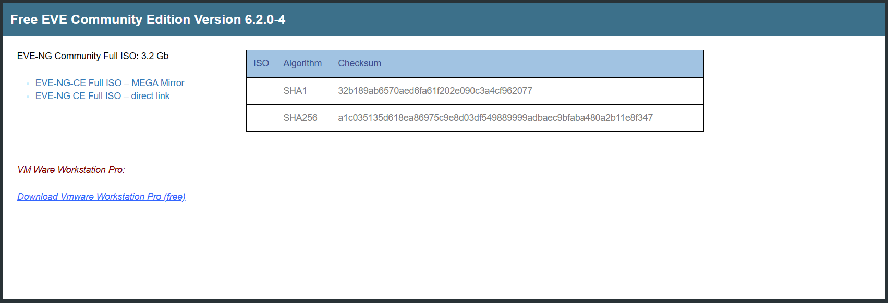
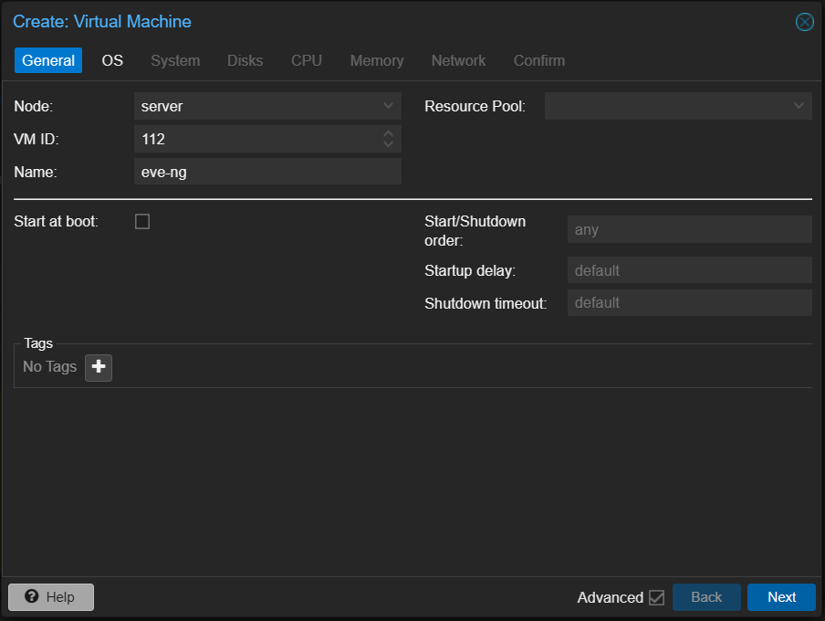
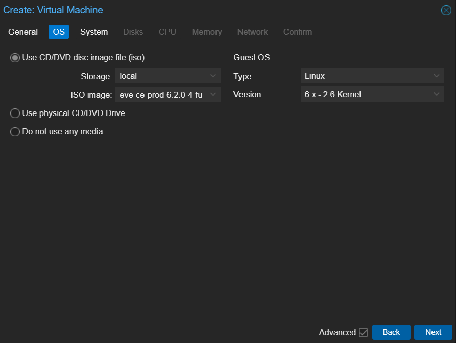
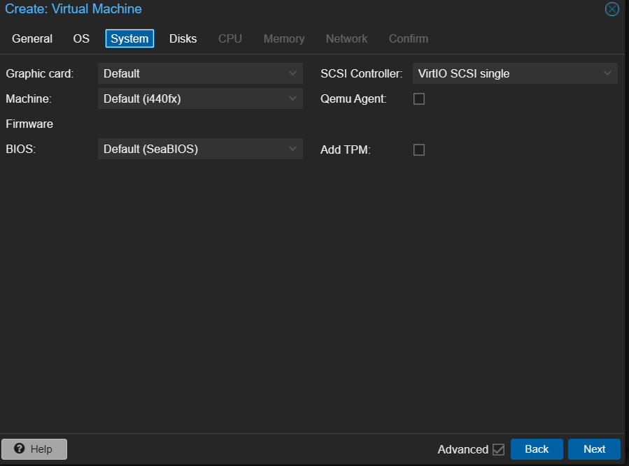
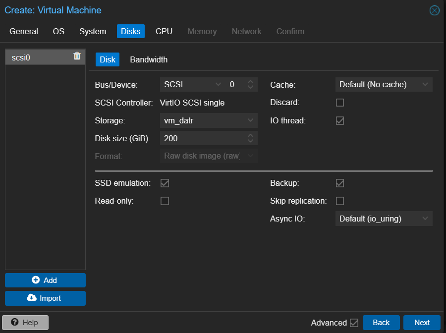
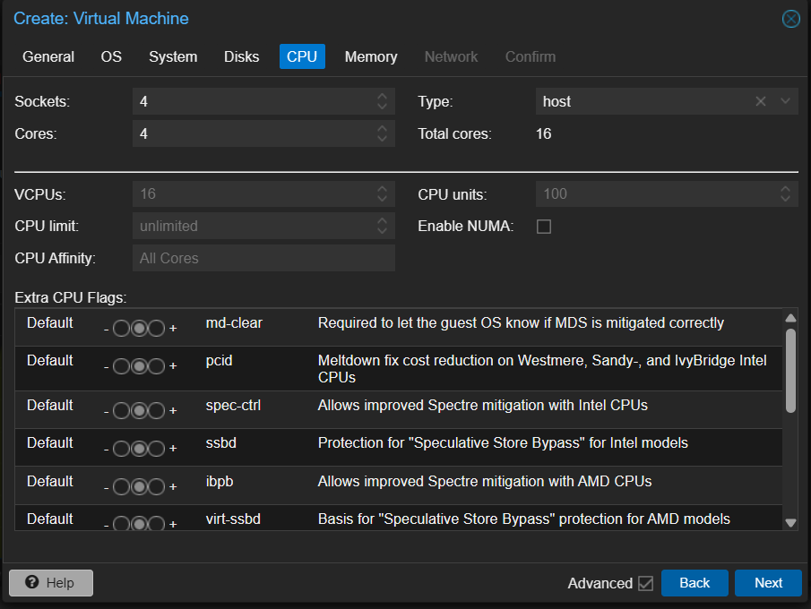
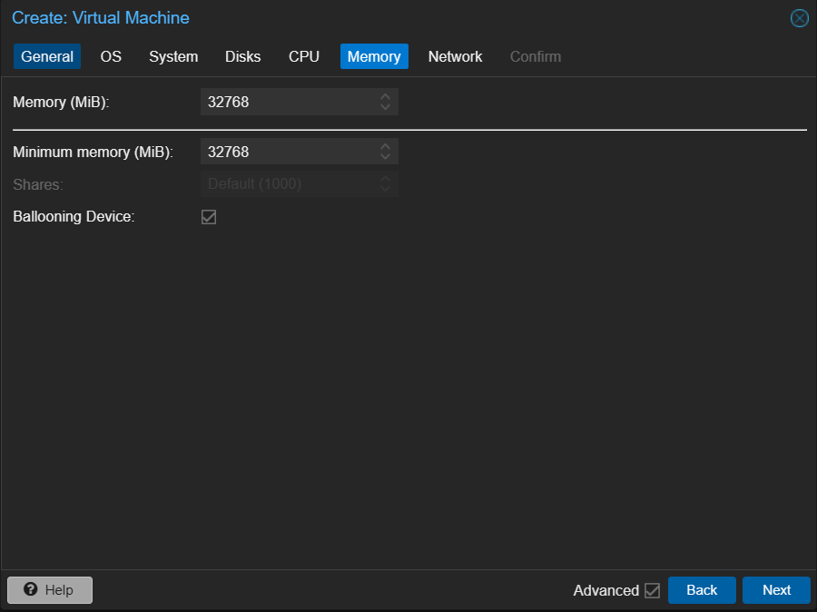
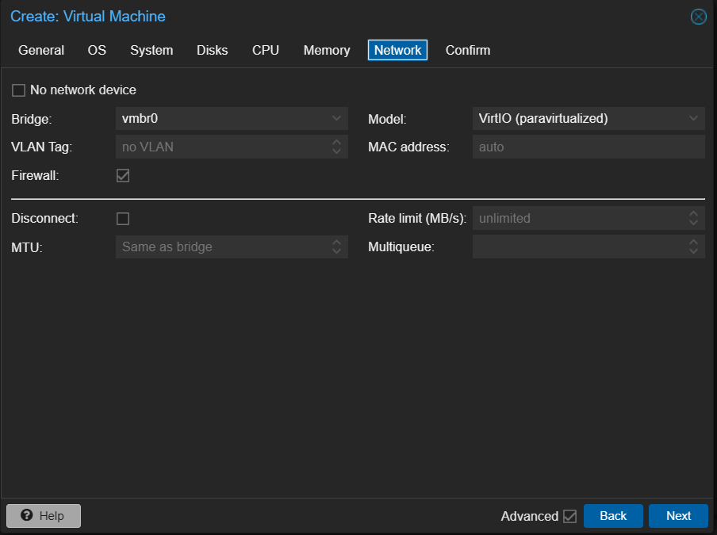
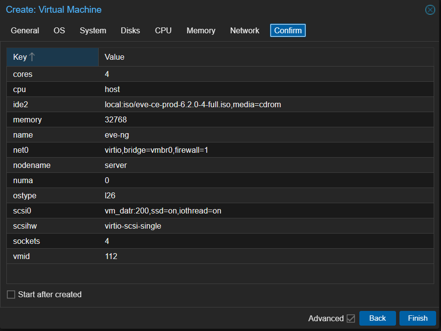
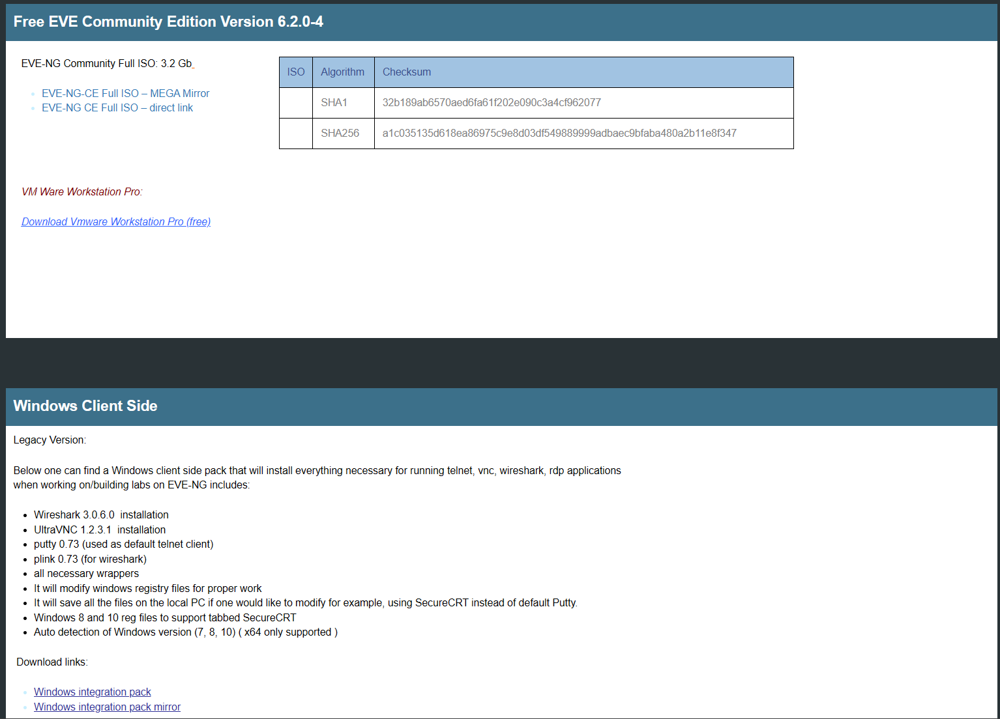

# EVE-NG Installation on Proxmox

> EVE-NG does not provide official Proxmox support.  
> This guide uses the **[EVE Community Edition](https://www.eve-ng.net/index.php/download/)**, which is straightforward and reliable.



## Overview

EVE-NG runs on a Ubuntu Server VM modifyed, that means no special Proxmox integration is required. At the end it is like you are installing and Ubuntu Server with an app running on top.

## Prerequisites

- Proxmox VE host (with virtualization enabled in BIOS/UEFI)
- The official ISO showed in the previus image
- At least:
    - **8 vCPU** (16+ recommended)
    - **16 GB RAM** (32+ recommended)
    - **100 GB disk** (SSD preferred)
- Bridge network configured on Proxmox (e.g. `vmbr0`)

## 1. Create the VM in Proxmox

1. Go to **Create VM**.

    

2. Set VM name (example: `eve-ng`).
    
3. Attach ISO.
    

    !!! tip "*[Upload ISO](https://youtu.be/77WA862mjF8?si=8Vnt_2qa4UD0l3dc)*"

        If you are not familiar with Proxmox, this short video shows how to upload an ISO to the local Storage.

4. Configure system:
     - BIOS: default (OVMF/SeaBIOS both work; keep defaults if unsure)
     - SCSI controller: VirtIO SCSI

    

5. Configure disks:
     - Bus: VirtIO
     - Size: 100 GB or more

    

6. Configure CPU:
     - Type: `host`
     - Cores: 2 or more
     - Threads: 4 or more

    

7. Configure memory:
     - 16384 MB (16GB) minimum (more recommended)

    

8. Configure network:
     - Model: VirtIO (paravirtualized)
     - Bridge: `vmbr0`

    

9. Finish and start VM.

    

## 2. Install Ubuntu Server

1. Boot from ISO and install "Ubuntu Server" normally.
2. Use a static IP if possible (recommended for lab access).
3. Install OpenSSH server during setup.


## 3. Configure EVE-NG

Follow the official *[EVE-NG Community](https://www.eve-ng.net/index.php/documentation/professional-cookbook/)*  instructions.  

After installation, reboot & upadte:

```bash
sudo reboot

sudo apt update && sudo apt upgrade -y
```

## 4. Post-Install on Proxmox

- In Proxmox VM options, ensure:
    - CPU type is `host`
    - Enough RAM/cores are assigned, that values will depend on the number of VM that will run.
- Optional but useful:
    - Enable VM autostart
    - Create a snapshot after successful setup

## 5. Access EVE-NG

Open browser:

```text
https://<EVE-NG-IP>/
```

Login with default/admin credentials from EVE-NG docs, then change passwords immediately.

!!! note "Notes"

    - This setup is **unofficial** but commonly used.
    - Performance depends heavily on CPU, RAM, and disk I/O.
    - For nested labs, ensure virtualization extensions are exposed to the VM.
    
    !!! tip "OS Client Suport"

        Download your OS Client Side for a better expirience

        


## Troubleshooting (Quick)

- **Web UI not reachable**: check VM IP, bridge config, firewall rules.
- **Poor performance**: increase vCPU/RAM, use SSD/NVMe storage.
- **Node boot issues**: verify nested virtualization support and CPU type `host`.
