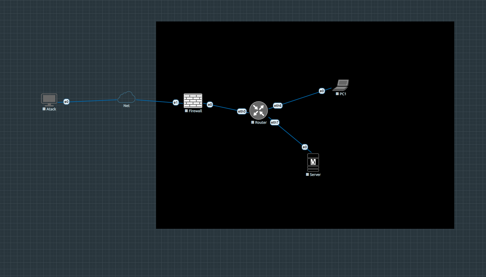

# LAB1 — Reconnaissance · PEBCAK Corp

!!! abstract "Lab at a glance"
    | | |
    |---|---|
    | **Difficulty** | ⭐ Easy |
    | **Category** | Reconnaissance · OSINT · SSH |
    | **Flags** | 1 |
    | **Est. time** | 45–90 min |
    | **Key skills** | HTTP source inspection, DNS resolution, SSH, firewall pivoting |
    | **Nodes** | pfSense · VyOS · Ubuntu Server · Ubuntu Desktop · Parrot OS |

[:simple-github: Lab folder on GitHub](https://github.com/TheEgea/TFG/tree/main/src/eve-ng/configs/nodes/Lab1){ .md-button }
[:material-download: Download topology (.unl)](https://github.com/TheEgea/TFG/raw/main/src/eve-ng/topologies/LAB1-Reconnaissance-PEBCAK.unl){ .md-button .md-button--primary }
[:material-file-pdf-box: Exercise sheet](../../assets/exercises/lab1-exercise.pdf){ .md-button }
[:material-file-pdf-box: Solution guide](../../assets/exercises/lab1-solution.pdf){ .md-button }

---

## Scenario

**PEBCAK Corp** has a small internal web server exposed to the homelab network.
The student takes the role of an external attacker with no prior credentials.
The goal is to enumerate the target, find credentials hidden in the web source,
access the server via SSH through the perimeter firewall, and retrieve the flag.

The flag reveals pfSense admin credentials, opening a secondary objective:
access the firewall management interface from an internal pivot point.

---

## Topology


*Screenshot of the EVE-NG canvas — Lab1.*

```
Homelab LAN (192.168.0.0/24)
        |
[Parrot — Attacker]  192.168.0.x (DHCP via pnet0 cloud)
        |
[pfSense — Firewall]
  WAN vtnet1: 192.168.0.x/24  (DHCP)
  LAN vtnet0: 172.16.1.1/30
        |
[VyOS — Router]
  eth0: 172.16.1.2/30    ← uplink to pfSense
  eth6: 192.168.10.1/24  ← Users LAN
  eth7: 192.168.20.1/24  ← Servers LAN
        |
  ┌─────┴─────┐
[Server]      [PC1]
192.168.20.10 192.168.10.20
nginx :80      Ubuntu Desktop
PEBCAK Corp    internal user
```

## Nodes

| Node | OS | IP | Role |
|------|----|----|------|
| pfSense | pfSense CE 2.6 | WAN: 192.168.0.x (DHCP) / LAN: 172.16.1.1 | Perimeter firewall · DNS · NAT · DNAT |
| VyOS | VyOS rolling | 172.16.1.2 / 192.168.10.1 / 192.168.20.1 | Core router · NAT |
| Server | Ubuntu Server 24.04 | 192.168.20.10 | Target — nginx · hostname: pebcak |
| PC1 | Ubuntu Desktop 24.04 | 192.168.10.20 | Internal user workstation |
| Parrot | Parrot Security 6.4 | 192.168.0.x (DHCP) | Attacker |

## Network segments

| Segment | Subnet | Gateway | Purpose |
|---------|--------|---------|---------|
| Net-Link | 172.16.0.0/30 | pfSense vtnet0 | pfSense ↔ VyOS |
| Users LAN | 192.168.10.0/24 | 192.168.10.x | PC1 segment |
| Servers LAN | 192.168.20.0/24 | 192.168.20.1 | Server segment |
| Homelab | 192.168.0.0/24 | 192.168.0.1 | WAN · Attacker |

---

## Learning objectives

1. Apply passive HTTP reconnaissance (page source, hidden paths)
2. Understand how DNS aliases expose internal naming conventions
3. Use SSH to access a target through a NAT/DNAT firewall rule
4. Pivot to a management interface using credentials found post-exploitation

---

## Attack flow

```
1. http://lab1                → PEBCAK Corp portal (Firefox on Parrot)
2. View page source           → <!-- sometimes simplify and search -->
3. http://lab1/pebcak.html   → SSH creds: blackmesa / !Bl4kM3s$
4. ssh blackmesa@lab1        → Server via pfSense DNAT (TCP 22)
5. cat ~/flag.txt             → FLAG{p3bc4k_s3rv3r_0wn3d} + pfSense creds
6. ssh admin@172.16.x.x      → pfSense access (pivot from Server via VyOS)
```

---

## Lab startup checklist

1. Start all nodes from EVE-NG web UI
2. Run bridge script on EVE-NG host (resets on reboot — persistent via udev):
   ```bash
   ip addr add 192.168.20.x/24 dev vnet0_2
   ip addr add 192.168.10.x/24 dev vnet0_3
   ip route add 172.16.0.0/30 via 192.168.20.1
   ```
3. Set DNS on Parrot to `192.168.0.x` (pfSense) so `lab1` resolves
4. Verify: `curl http://lab1` from Parrot Firefox

---

## Files

| File | Description |
|------|-------------|
| [`LAB1-Reconnaissance-PEBCAK.unl`](https://github.com/TheEgea/TFG/raw/main/src/eve-ng/topologies/LAB1-Reconnaissance-PEBCAK.unl) | EVE-NG topology — import directly |
| [`nodes/Lab1/`](https://github.com/TheEgea/TFG/tree/main/src/eve-ng/configs/nodes/Lab1) | Node configs: VyOS boot, pfSense XML, nginx, web pages |
