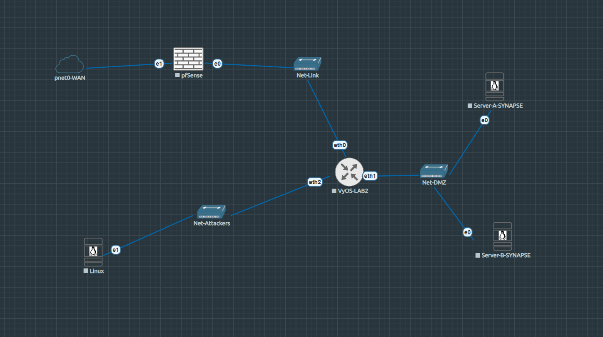

# LAB2 — Web Vulnerabilities · SYNAPSE

!!! abstract "Lab at a glance"
    | | |
    |---|---|
    | **Difficulty** | ⭐⭐ Medium |
    | **Category** | Web App Security · OWASP Top 10 |
    | **Flags** | 3 |
    | **Est. time** | 90–150 min |
    | **Key skills** | XSS, cookie hijack, broken auth, SQL injection, YAML deserialization, RCE |
    | **Nodes** | pfSense · VyOS · Server-A (SYNAPSE Portal) · Server-B (DataVault) · Parrot OS |

[:simple-github: Lab folder on GitHub](https://github.com/TheEgea/TFG/tree/main/src/eve-ng/configs/nodes/Lab2){ .md-button }
[:material-download: Download topology (.unl)](https://github.com/TheEgea/TFG/raw/main/src/eve-ng/topologies/LAB2-WebVulnerabilities-SYNAPSE.unl){ .md-button .md-button--primary }
[:material-file-pdf-box: Exercise sheet](../../assets/exercises/lab2-exercise.pdf){ .md-button }
[:material-file-pdf-box: Solution guide](../../assets/exercises/lab2-solution.pdf){ .md-button }

---

## Scenario

**SYNAPSE Intelligence Corp** runs two internal web applications on a segmented network.
The student is an external attacker who must chain five OWASP Top 10 vulnerabilities
across both servers to achieve remote code execution and data exfiltration.

The attack starts with stored XSS to steal an admin session cookie, pivots through broken
authentication and SQL injection to reach Server-B credentials, and culminates in YAML
deserialization for a full reverse shell.

---

## Topology


*Screenshot of the EVE-NG canvas — Lab2.*

```
Homelab LAN (192.168.0.0/24)
        |
[pfSense-LAB2]  WAN: 192.168.0.x (DHCP)
        |        LAN: 172.16.1.1/30
[VyOS-LAB2]
  eth0: 172.16.1.2/30   ← uplink to pfSense
  eth1: 192.168.30.1/24 ← Net-DMZ (servers)
  eth2: 10.0.40.1/24    ← Net-Attackers (Parrot)
        |
  +-----+--------+            |
[Server-A]    [Server-B]    [Parrot]
192.168.30.10 192.168.30.20 10.0.40.10
SYNAPSE Portal  DataVault    Attacker
XSS+Auth+SQLi   YAML RCE
```

## Nodes

| Node | OS | IP | Role |
|------|----|----|------|
| pfSense-LAB2 | pfSense CE | WAN: 192.168.0.x / LAN: 172.16.x.x | Perimeter firewall · UEFI boot |
| VyOS-LAB2 | VyOS rolling | 172.16.1.2 / 192.168.30.1 / 10.0.40.1 | Router · NAT · DNS |
| Server-A | Ubuntu Server 24.04 | 192.168.30.10 | SYNAPSE Portal — Flask + nginx + victim bot |
| Server-B | Ubuntu Server 24.04 | 192.168.30.20 | DataVault — Flask + PyYAML deserialization |
| Parrot | Parrot Security 6.4 | 10.0.40.10 (static) | Attacker |

## Network segments

| Segment | Subnet | Gateway | Purpose |
|---------|--------|---------|---------|
| Net-Link | 172.16.0.0/30 | pfSense vtnet0 | pfSense ↔ VyOS |
| Net-DMZ | 192.168.30.0/24 | 192.168.30.1 | Server-A + Server-B |
| Net-Attackers | 10.0.40.0/24 | 10.0.40.1 | Parrot attacker |
| Homelab | 192.168.0.0/24 | 192.168.0.1 | WAN |

---

## Learning objectives

1. Exploit stored XSS to steal a session cookie from a bot victim
2. Forge authentication tokens with broken auth (unsigned cookie manipulation)
3. Extract credentials via UNION-based SQL injection
4. Chain application vulnerabilities across multiple services
5. Achieve RCE through YAML insecure deserialization (`yaml.UnsafeLoader`)

---

## Vulnerability chain

```
Stored XSS → Cookie Hijack → Broken Auth → SQLi → Admin Panel → YAML RCE → Exfil
```

| Step | Vulnerability | OWASP | Location | Flag |
|------|--------------|-------|----------|------|
| 1 | Stored XSS | A03 | `/comments` — Jinja2 `\| safe` filter | — |
| 2 | Cookie theft | A07 | `HttpOnly=False` session cookie | — |
| 3 | Broken authentication | A07 | Unsigned `ID:ROLE:USERNAME` cookie | — |
| 4 | UNION SQL Injection | A03 | `/search?q=` — raw string concat | **FLAG 1** |
| 5 | Admin panel access | A01 | `/admin` — classified intel + Server-B creds | **FLAG 2** |
| 6 | YAML deserialization | A08 | Server-B `/preview` — `yaml.UnsafeLoader` | — |
| 7 | RCE via reverse shell | A08 | YAML `!!python/object/apply:os.system` | **FLAG 3** |

## Credentials

| User | Password | System | Role |
|------|----------|--------|------|
| ubuntu | S3rv3rA | Server-A OS | SSH |
| admin | Admin@Synapse2024 | Server-A Portal | admin |
| guest | guest123 | Server-A Portal | guest |
| ubuntu | S3rv3rB | Server-B OS | SSH |
| operator | D4t4V4ult#2024 | Server-B DataVault | operator |
| lab2 | L4b2 | Parrot OS | SSH |

---

## Lab startup checklist

1. Run bridge script on EVE-NG host (after reboot):
   ```bash
   bash /usr/local/bin/lab2-bridges-up.sh
   ```
2. Start SYNAPSE Portal on Server-A:
   ```bash
   sshpass -p S3rv3rA ssh ubuntu@192.168.30.10
   cd /opt/synapse && docker-compose up -d
   ```
3. Start DataVault on Server-B:
   ```bash
   sshpass -p S3rv3rB ssh ubuntu@192.168.30.20
   cd /opt/datavault && sudo docker compose up -d
   ```
4. Configure Parrot static IP (`10.0.40.10/24`, GW `10.0.40.1`)

!!! warning "Caveats"
    - pfSense-LAB2 uses **UEFI boot** — use `/usr/local/bin/pfsense-lab2-start.sh`
    - Server-A uses `docker-compose` v1 (hyphen). Server-B uses `docker compose` v2 (space).
    - Bridge IPs reset on EVE-NG host reboot — always run the bridge script first.

---

## Files

| File | Description |
|------|-------------|
| [`LAB2-WebVulnerabilities-SYNAPSE.unl`](https://github.com/TheEgea/TFG/raw/main/src/eve-ng/topologies/LAB2-WebVulnerabilities-SYNAPSE.unl) | EVE-NG topology — import directly |
| [`nodes/Lab2/server-a/`](https://github.com/TheEgea/TFG/tree/main/src/eve-ng/configs/nodes/Lab2/server-a) | Flask app, nginx config, victim bot, docker-compose |
| [`nodes/Lab2/server-b/`](https://github.com/TheEgea/TFG/tree/main/src/eve-ng/configs/nodes/Lab2/server-b) | DataVault Flask app, docker-compose |
| [`nodes/Lab2/vyos/`](https://github.com/TheEgea/TFG/tree/main/src/eve-ng/configs/nodes/Lab2/vyos) | VyOS config.boot |
