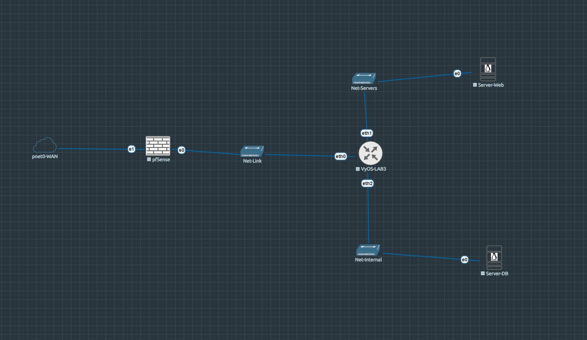

# LAB3 — Incident Response · HELIX Systems

!!! abstract "Lab at a glance"
    | | |
    |---|---|
    | **Difficulty** | ⭐⭐ Medium |
    | **Category** | Incident Response · Log Forensics · Blue Team |
    | **Flags** | 3 |
    | **Est. time** | 90–120 min |
    | **Key skills** | Log analysis, SSH brute-force forensics, privilege escalation detection, lateral movement |
    | **Nodes** | pfSense · VyOS · Server-Web · Server-DB |

[:simple-github: Lab folder on GitHub](https://github.com/TheEgea/TFG/tree/main/src/eve-ng/configs/nodes/Lab3){ .md-button }
[:material-download: Download topology (.unl)](https://github.com/TheEgea/TFG/raw/main/src/eve-ng/topologies/LAB3-IncidentResponse-HELIX.unl){ .md-button .md-button--primary }
[:material-file-pdf-box: Exercise sheet](../../assets/exercises/lab3-exercise.pdf){ .md-button }
[:material-file-pdf-box: Solution guide](../../assets/exercises/lab3-solution.pdf){ .md-button }

---

## Scenario

**HELIX Systems** is a fictional company with a two-tier internal infrastructure.
Unlike the previous labs, the student here plays the **defender** role: the attack has already happened.

An unknown threat actor brute-forced SSH credentials on the web server, escalated privileges
via a misconfigured `sudoers` entry, established persistence with a backdoor account,
and moved laterally to the database server to exfiltrate sensitive client data.

The task is to connect to the affected systems, collect and correlate log evidence,
and reconstruct the attacker’s complete activity timeline as a SOC analyst.

---

## Topology


*Screenshot of the EVE-NG canvas — Lab3.*

```
Homelab LAN (192.168.0.0/24)
        |
[pfSense-LAB3]  WAN: 192.168.0.x (DHCP)  ← student entry (DNAT TCP:22 → Server-Web)
        |        LAN: 172.16.2.1/30
[VyOS-LAB3]
  eth0: 172.16.2.2/30     ← uplink to pfSense
  eth1: 192.168.50.1/24   ← Net-Servers
  eth2: 192.168.60.1/24   ← Net-Internal
        |              |
[Server-Web]      [Server-DB]
192.168.50.10     192.168.60.10
Primary target    Lateral movement
auth.log          clients.db
bash history      exfil_marker
```

## Nodes

| Node | OS | IP | Role |
|------|----|----|------|
| pfSense-LAB3 | pfSense CE | WAN: 192.168.0.x / LAN: 172.16.2.1/30 | Perimeter firewall · DNAT student entry |
| VyOS-LAB3 | VyOS rolling | 172.16.2.2 / 192.168.50.1 / 192.168.60.1 | Router · SNAT |
| Server-Web | Ubuntu Server 24.04 | 192.168.50.10 | Primary forensic target (helix-web) |
| Server-DB | Ubuntu Server 24.04 | 192.168.60.10 | Lateral movement target (helix-db) |

## Network segments

| Segment | Subnet | Gateway | Purpose |
|---------|--------|---------|---------|
| Net-Link | 172.16.2.0/30 | pfSense vtnet0 | pfSense ↔ VyOS |
| Net-Servers | 192.168.50.0/24 | 192.168.50.1 | Server-Web |
| Net-Internal | 192.168.60.0/24 | 192.168.60.1 | Server-DB |
| Homelab | 192.168.0.0/24 | 192.168.0.1 | WAN · Student entry |

---

## Learning objectives

1. Read and correlate `auth.log` entries to identify SSH brute-force patterns
2. Detect privilege escalation via `sudo` misconfiguration in `sudoers`
3. Identify persistence mechanisms (backdoor accounts, cron jobs)
4. Trace lateral movement between servers using network logs and bash history
5. Reconstruct a complete attacker timeline from pre-staged evidence

---

## Investigation flow

```
1. SSH into Server-Web via pfSense DNAT (student entry point)
2. Analyse /var/log/auth.log       → brute-force source IP + success timestamp
3. Review /home/devops/.bash_history → privilege escalation commands
4. Check /etc/sudoers              → misconfigured entry (sudo find → root)
5. Find /etc/passwd + shadow       → backdoor account created post-compromise
6. SSH to Server-DB (192.168.60.10)→ lateral movement confirmed
7. Locate /opt/data/clients.db     → exfiltrated database
8. Find /tmp/.exfil_marker         → exfiltration evidence
```

---

## Lab startup checklist

1. Start all nodes from EVE-NG web UI
2. Verify pfSense DNAT rule forwards TCP 22 (WAN) → Server-Web (192.168.50.10)
3. Student entry: `ssh devops@192.168.0.x` (pfSense WAN IP)
4. Evidence is pre-staged — no additional setup required

!!! info "Student credentials"
    - **Server-Web entry**: `devops` / `devops123` (via pfSense DNAT)
    - **Server-DB**: reachable from Server-Web once lateral movement path is found

---

## Evidence artefacts

| Artefact | Location | Contains |
|----------|----------|---------|
| `auth.log` | `/var/log/auth.log` (Server-Web) | SSH brute-force + successful login |
| `bash_history` | `/home/devops/.bash_history` | Post-exploitation commands |
| `clients.db` | `/opt/data/clients.db` (Server-DB) | Exfiltrated client data |
| `exfil_marker` | `/tmp/.exfil_marker` (Server-DB) | Exfiltration timestamp |

---

## Files

| File | Description |
|------|-------------|
| [`LAB3-IncidentResponse-HELIX.unl`](https://github.com/TheEgea/TFG/raw/main/src/eve-ng/topologies/LAB3-IncidentResponse-HELIX.unl) | EVE-NG topology — import directly |
| [`nodes/Lab3/server-web/`](https://github.com/TheEgea/TFG/tree/main/src/eve-ng/configs/nodes/Lab3/server-web) | Pre-staged auth.log, bash history, sudoers |
| [`nodes/Lab3/server-db/`](https://github.com/TheEgea/TFG/tree/main/src/eve-ng/configs/nodes/Lab3/server-db) | clients.db, exfil\_marker, network config |
| [`nodes/Lab3/vyos/`](https://github.com/TheEgea/TFG/tree/main/src/eve-ng/configs/nodes/Lab3/vyos) | VyOS config.boot |
