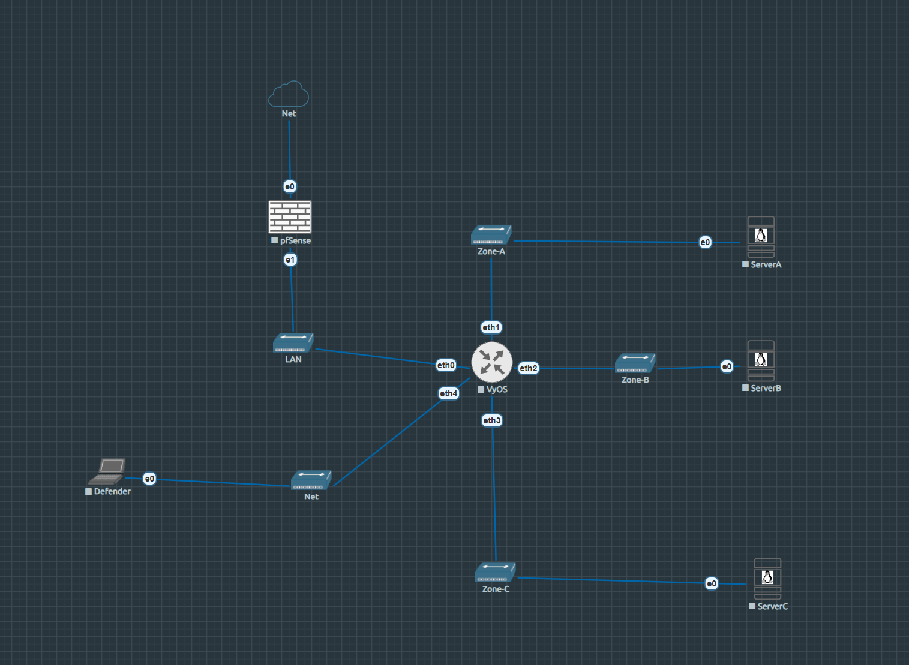

# LAB4 — Cryptography & Steganography CTF · CipherStrike

!!! abstract "Lab at a glance"
    | | |
    |---|---|
    | **Difficulty** | ⭐⭐⭐ Hard |
    | **Category** | Cryptography · Steganography · CTF |
    | **Flags** | 14 (A1–A5, B1–B5, C1–C4) |
    | **Est. time** | 180–300 min |
    | **Key skills** | Classical ciphers, AES-ECB oracle, RSA small exponent, LSB stego, steghide, ECDSA nonce reuse |
    | **Nodes** | pfSense · VyOS · ServerA · ServerB · ServerC · Defender |

[:simple-github: Lab folder on GitHub](https://github.com/TheEgea/TFG/tree/main/src/eve-ng/configs/nodes/Lab4){ .md-button }
[:material-download: Download topology (.unl)](https://github.com/TheEgea/TFG/blob/main/src/eve-ng/topologies/LAB4-CryptographySteganography-CipherStrike.unl){ .md-button .md-button--primary }
[:material-file-pdf-box: Exercise sheet](../../assets/exercises/lab4-exercise.pdf){ .md-button }
[:material-file-pdf-box: Solution guide](../../assets/exercises/lab4-solution.pdf){ .md-button }

---

## Scenario

**NovaCorp** has been breached. As a member of the incident response team,
you have recovered a set of intercepted communications and suspicious image files
from the attacker's exfiltrated archive.

Your mission is to break the ciphers, extract hidden data from the images, and
reconstruct the attacker's communication channel step by step.

The investigation is divided into three modules:

- **Module A — Cryptography** (ServerA, 5 challenges): from simple substitution
  ciphers to asymmetric key attacks.
- **Module B — Steganography** (ServerB, 5 challenges): from EXIF metadata to
  least-significant-bit encoding and password-protected steganography.
- **Module C — Advanced Mix** (ServerC, 4 challenges): multilayer techniques
  combining cryptography and steganography. **Access is gated** — you need the
  key flags from modules A and B first.

---

## Topology


*Screenshot of the EVE-NG canvas — Lab4.*

```
Homelab LAN (192.168.0.0/24)
        |
[pfSense-LAB4]  WAN: 192.168.0.18 (DHCP)
        |        LAN: 192.168.1.1/24
[VyOS-LAB4]
  eth0: 192.168.1.2/24   ← uplink to pfSense
  eth1: 10.10.1.1/24     ← Zone-A (ServerA)
  eth2: 10.10.2.1/24     ← Zone-B (ServerB)
  eth3: 10.10.3.1/24     ← Zone-C (ServerC) [GATED]
  eth4: 10.10.4.1/24     ← Zone-Defense (Defender)
        |
[ServerA]  [ServerB]  [ServerC]  [Defender]
10.10.1.10  10.10.2.10  10.10.3.10  10.10.4.10
Crypto      Stego       Adv Mix     Monitoring
```

## Nodes

| Node | OS | IP | Role |
|------|----|----|------|
| pfSense-LAB4 | pfSense CE | WAN: 192.168.0.18 / LAN: 192.168.1.1 | Perimeter firewall · NAT |
| VyOS-LAB4 | VyOS rolling | 192.168.1.2 / 10.10.x.1 | Core router · zone segmentation |
| ServerA | Ubuntu Server 24.04 | 10.10.1.10 | Cryptography module |
| ServerB | Ubuntu Server 24.04 | 10.10.2.10 | Steganography module |
| ServerC | Ubuntu Server 24.04 | 10.10.3.10 | Advanced mix — **gated access** |
| Defender | Ubuntu Desktop 24.04 | 10.10.4.10 | SOC monitoring node |

## Network segments

| Segment | Subnet | Gateway | Purpose |
|---------|--------|---------|---------|
| WAN | 192.168.0.0/24 | 192.168.0.1 | pfSense WAN (Homelab) |
| Net-Link | 192.168.1.0/24 | 192.168.1.1 | pfSense ↔ VyOS |
| Zone-A | 10.10.1.0/24 | 10.10.1.1 | ServerA — Cryptography |
| Zone-B | 10.10.2.0/24 | 10.10.2.1 | ServerB — Steganography |
| Zone-C | 10.10.3.0/24 | 10.10.3.1 | ServerC — Advanced Mix |
| Zone-Defense | 10.10.4.0/24 | 10.10.4.1 | Defender |

---

## Learning objectives

1. Apply classical cryptanalysis techniques (frequency analysis, Kasiski examination)
2. Execute modern symmetric cipher attacks (AES-ECB oracle, XOR crib-dragging)
3. Understand and exploit RSA small-exponent vulnerability ($e=3$, cube root attack)
4. Extract hidden data from image EXIF metadata and binary structures
5. Perform LSB steganography extraction from RGB and alpha channels
6. Crack steghide-protected JPEG payloads
7. Recognise and exploit ECDSA nonce reuse to recover a private key
8. Chain CTF challenges across multiple servers using derived credentials

---

## The gate mechanism

!!! warning "Read this before starting"
    Access to **ServerC** requires solving **A5** (RSA challenge on ServerA) and
    **B5** (steghide JPEG on ServerB). The ServerC password is derived as:

    ```
    password = md5(flag_A5 + flag_B5)[:12]
    ```
    Where `flag_A5` and `flag_B5` are the full flag strings (e.g. `FLAG{...}`),
    concatenated without separator, hashed with MD5 (hex digest),
    and the first 12 characters used as the password.

    You will not be told the password directly. Derive it yourself once you have
    both flags.

---

## Module A — Cryptography (ServerA)

**Entry:** `ssh admin@10.10.1.10` (password: `N3xaTech!`)

All challenge files are in `/home/admin/mensajes/`.

| Challenge | File | Topic | Difficulty |
|-----------|------|-------|-----------|
| A1 | `A1_mensaje_interceptado.txt` | ROT13 | Easy |
| A2 | `A2_oracle.py` + `A2_admin_cipher.b64` | AES-ECB oracle attack | Easy–Medium |
| A3 | `A3_documento_clasificado.txt` | Vigenère cipher + Kasiski analysis | Medium |
| A4 | `A4_mensaje_xor.hex` | XOR repeating key + crib-dragging | Medium |
| A5 | `A5_rsa_challenge.txt` | RSA small exponent ($e=3$) | Medium–Hard |

### Hints

??? hint "A1 — not sure where to start?"
    The text looks like English but isn't. Every letter has been shifted by a
    fixed amount. `python3 -c "import codecs; print(codecs.decode(open(...).read(), 'rot_13'))"` is one approach.

??? hint "A2 — understanding ECB mode"
    AES-ECB encrypts each 16-byte block independently. If you can make the oracle
    encrypt a block you control followed by an unknown block, you can recover the
    unknown byte-by-byte. The `A2_oracle.py` script is your encryption oracle.

??? hint "A3 — Kasiski examination"
    Look for repeated trigrams in the ciphertext. The distance between repetitions
    is a multiple of the key length. Once you know the key length, treat each
    column as a Caesar cipher.

??? hint "A4 — crib-dragging"
    If you know (or can guess) a word that appears in the plaintext, XOR that
    word against every position of the ciphertext. A correctly placed crib reveals
    the key bytes at that position.

??? hint "A5 — cube root attack"
    When RSA uses $e=3$ and the message is short enough that $m^3 < n$, the
    ciphertext is literally $m^3$ with no modular reduction. Compute the integer
    cube root of the ciphertext with `gmpy2.iroot(c, 3)` and convert to bytes.

---

## Module B — Steganography (ServerB)

**Entry:** `ssh sysop@10.10.2.10` (password: `S3cure24!`)

All challenge files are in `/srv/public/uploads/`.

| Challenge | File | Topic | Difficulty |
|-----------|------|-------|-----------|
| B1 | `B1_oficina_novacorp.png` | EXIF metadata | Easy |
| B2 | `B2_network_diagram.png` | Data after PNG IEND chunk | Easy–Medium |
| B3 | `B3_documento_escaneado.png` | LSB in red channel | Medium |
| B4 | `B4_novacorp_logo.png` | LSB in alpha channel (RGBA) | Medium |
| B5 | `B5_camara_seguridad.jpg` | Steghide JPEG | Medium |

### Hints

??? hint "B1 — where metadata hides"
    Images carry EXIF metadata: camera model, GPS coordinates, software, and
    custom fields. `exiftool B1_oficina_novacorp.png` shows all fields.

??? hint "B2 — beyond the end"
    A valid PNG ends at the IEND chunk. Anything after that is ignored by image
    viewers but is still present in the file. Read the raw bytes past the IEND
    marker.

??? hint "B3 — LSB basics"
    The least-significant bit of each pixel's red channel carries one bit of
    hidden data. Read the red channel of each pixel in row order and assemble
    the bits into bytes.

??? hint "B4 — transparency channel"
    PNG images with transparency have an alpha channel. The LSB of the alpha
    value of each pixel can carry hidden data. Open with Pillow, select `'A'`
    channel.

??? hint "B5 — steghide and passwords"
    Steghide embeds data inside a JPEG using a passphrase. The passphrase for
    this challenge is related to the company name in the scenario.
    `steghide extract -sf B5_camara_seguridad.jpg`

---

## Module C — Advanced Mix (ServerC)

!!! danger "Gated access"
    Derive the ServerC password from flags A5 and B5 before attempting this module.

**Entry:** `ssh devops@10.10.3.10` (password: *derived — see gate mechanism*)

All challenge files are in `/home/devops/retos/`.

| Challenge | File(s) | Topic | Difficulty |
|-----------|---------|-------|-----------|
| C1 | `C1_backup_tapes.jpg` | Multilayer: EXIF → steghide → ZIP | Hard |
| C2 | `C2_backup_log.b64` | Onion encoding layers | Hard |
| C3 | `C3_api_token.txt` + `C3_verificador.py` | SHA-1 length extension | Hard |
| C4 | `C4_ecdsa_signatures.txt` + `C4_verificador.py` | ECDSA nonce reuse | Hard |

### Hints

??? hint "C1 — follow the layers"
    Start with `exiftool` to find a clue embedded in the EXIF data. That clue
    leads to a steghide passphrase. The steghide payload is a ZIP archive
    containing the final hidden data.

??? hint "C2 — peel the onion"
    The file is base64 encoded. After decoding: decompress with gzip. After
    decompressing: base64 again. After decoding: decompress with bzip2.
    The flag is inside. Work layer by layer.

??? hint "C3 — length extension"
    Some hash-based authentication schemes compute `HMAC = hash(secret + message)`.
    For MD5 and SHA-1, an attacker who knows the hash output can append extra
    data and compute a valid hash for `secret + message + padding + extra` without
    knowing the secret. The `hlextend` Python library automates this.

??? hint "C4 — reused nonce in ECDSA"
    ECDSA signature security depends entirely on using a unique random nonce $k$
    per signature. If the same $k$ is used twice with different messages, the
    private key can be algebraically recovered from the two $(r, s)$ pairs.
    Check whether any two signatures in the file share the same $r$ value.

---

## Lab startup checklist

1. Start all nodes from EVE-NG web UI in order: pfSense → VyOS → ServerA → ServerB → ServerC → Defender
2. Verify zone routing from VyOS console: `show ip route`
3. Confirm SSH access:
   - `ssh admin@10.10.1.10` — Module A entry point
   - `ssh sysop@10.10.2.10` — Module B entry point
4. Solve A5 and B5, derive ServerC password, then: `ssh devops@10.10.3.10`

---

## Files

| File | Description |
|------|-------------|
| [`LAB4-CryptoStego-CipherStrike.unl`](https://github.com/TheEgea/TFG/raw/main/src/eve-ng/topologies/LAB4-CryptoStego-CipherStrike.unl) | EVE-NG topology — import directly |
| [`nodes/Lab4/serverA/`](https://github.com/TheEgea/TFG/tree/main/src/eve-ng/configs/nodes/Lab4/serverA) | Challenge files + Python deps for ServerA |
| [`nodes/Lab4/serverB/`](https://github.com/TheEgea/TFG/tree/main/src/eve-ng/configs/nodes/Lab4/serverB) | Challenge files + image assets for ServerB |
| [`nodes/Lab4/serverC/`](https://github.com/TheEgea/TFG/tree/main/src/eve-ng/configs/nodes/Lab4/serverC) | Challenge files + hlextend vendor for ServerC |
| [`nodes/Lab4/vyos/`](https://github.com/TheEgea/TFG/tree/main/src/eve-ng/configs/nodes/Lab4/vyos) | VyOS config.boot |
